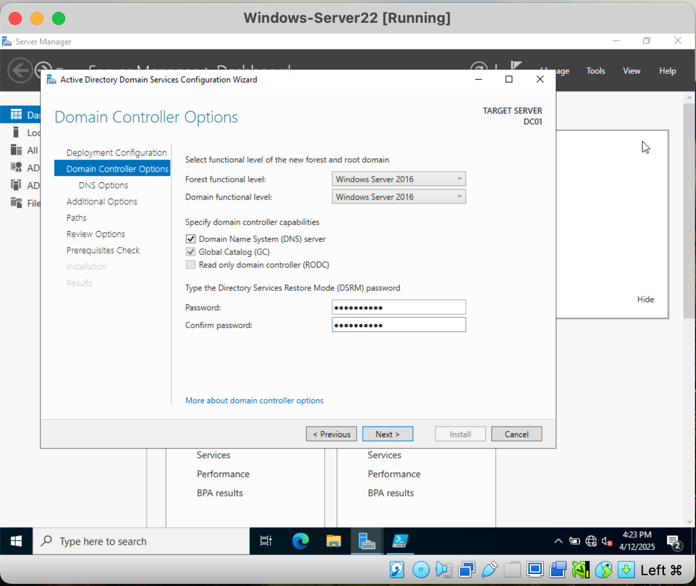
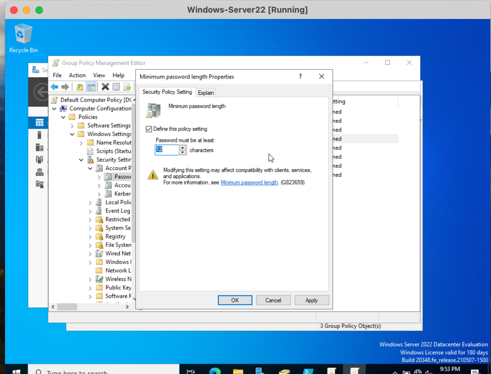
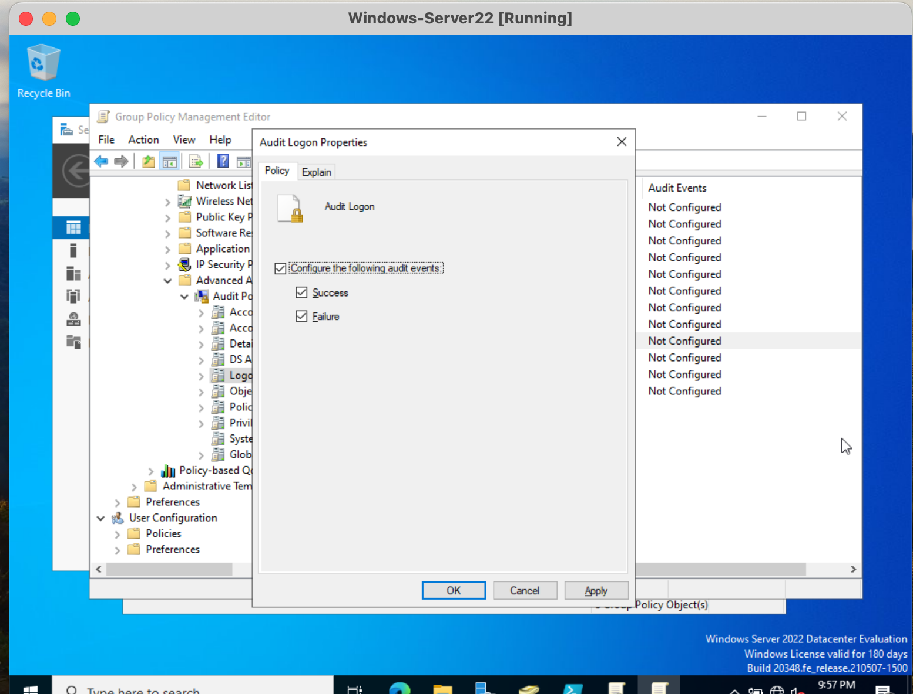
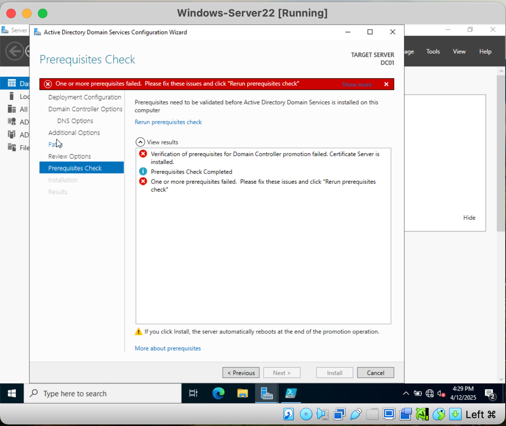
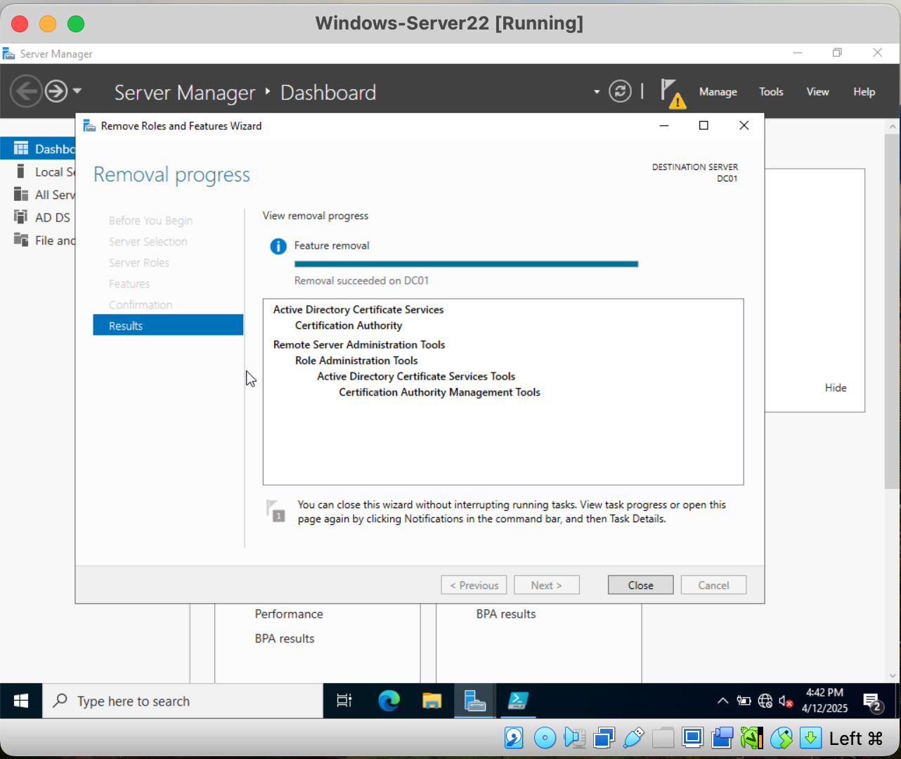

# Active Directory Foundation - Enterprise Windows Server Lab

## Project Overview
This repository documents my implementation of an enterprise-grade Windows Server 2022 infrastructure with Microsoft 365 integration. The project demonstrates how I would setup a small or mid-sized business to manages user identities permissions and security policies across every machine on their network. 

## Architecture


The environment is built around a single Domain Controller (DC01, Windows Server 2022) hosting the `enterprise.lab` domain, with a department-based Organizational Unit structure separate OUs for IT, Sales, and Finance, plus a dedicated Servers OU and a Service Accounts OU kept isolated from human user accounts.

**Design decisions:**
- **Department-based OUs** so Group Policy can be targeted per department later without restructuring the directory
- **Isolated Service Accounts OU** automated processes (backup, SQL, web app, file sync, monitoring) run under dedicated service accounts rather than personal or shared admin credentials, reducing blast radius if any one credential is compromised
- **Group-based access control** for file share permissions instead of assigning permissions to individual users this makes access audits and offboarding dramatically simpler at scale
- **Domain-wide password and audit policy** enforced through Group Policy rather than local, per-machine configuration, so every domain-joined machine inherits the same security baseline automatically

## Implementation

### Domain Controller Promotion
Installed the AD DS role and promoted the server to a Domain Controller, creating a new forest for `enterprise.lab` at the Windows Server 2016 functional level, with DNS installed alongside AD DS.

```powershell
Install-WindowsFeature -Name AD-Domain-Services -IncludeManagementTools

Install-ADDSForest `
  -DomainName "enterprise.lab" `
  -DomainNetbiosName "ENTERPRISE" `
  -ForestMode "WinThreshold" `
  -DomainMode "WinThreshold" `
  -InstallDns:$true
```

**Verification:**
```powershell
Get-ADForest
Get-ADDomain
Get-ADDomainController -Filter *
```

### Organizational Units, Users & Groups
Built a department-based OU structure (IT, Sales, Finance, plus a dedicated Servers OU), provisioned department users and 5 service accounts through Active Directory Users and Computers, and configured group-based access control for file share permissions.

```powershell
New-ADUser -Name "Admin User" -SamAccountName "adminuser" `
  -UserPrincipalName "adminuser@enterprise.lab" -Enabled $true `
  -PasswordNeverExpires $true

Add-ADGroupMember -Identity "Domain Admins" -Members "adminuser"
```

### Domain Security Baseline (Group Policy)
Configured a domain-wide password and audit policy through the Default Domain Policy in Group Policy Management Editor:
- **Minimum password length:** 12 characters
- **Password complexity requirements:** Enabled
- **Audit Logon events:** Success and Failure, so both successful and failed sign-in attempts are logged domain-wide, giving visibility into potential brute-force or unauthorized access attempts

## Screenshots


*Forest and domain functional level configuration during DC promotion*
<br />


*Dedicated service accounts, isolated from human user accounts*
<br />


*File share permissions assigned to a security group rather than individual users*
<br />


*Domain-wide minimum password length set to 12 characters via Group Policy*
<br />


*Success and Failure logon auditing enabled domain-wide*
<br />

### PowerShell Bulk User Provisioning

Built a PowerShell script that creates Active Directory user accounts from a
spreadsheet instead of clicking through Active Directory Users and Computers one
account at a time.

Before building it, I audited the twelve accounts already in the domain. None of them
had a Department set. One account was sitting outside the department folder structure,
and one used a different username format from every other account. Those are the exact
mistakes that happen when accounts are created by hand — and the reason to script it.

The script reads a CSV file, builds each username to the same standard, creates the
account in the right department folder with its job title and department filled in,
and adds the user to the security group that controls their file share access.

**What it does**

- **Safe to run twice** — checks whether an account already exists before creating it,
  so re-running the same file doesn't create duplicates
- **Preview mode** — `-WhatIf` shows exactly what would be created before anything
  actually is
- **No password stored in the file** — prompts for a temporary password when it runs,
  and forces the user to change it at first login
- **One bad row doesn't stop the batch** — if a row fails, the rest still get created
- **Reports results** — shows created, skipped, and failed counts at the end


**Skills:** PowerShell · Active Directory · automating repetitive admin tasks ·
handling passwords securely · writing scripts other people can safely re-run

📄 [Full write-up — how it works, what broke, and what I'd improve](./documentation/bulk-user-provisioning.md)
💻 [`scripts/New-BulkADUser.ps1`](./scripts/New-BulkADUser.ps1)


## Problems Encountered

**Problem:** During the initial AD DS promotion, the prerequisites check failed.
**Solution:** An existing Certificate Services installation conflicted with the Domain Controller promotion prerequisites. Removed/reconfigured Certificate Services and re-ran the promotion successfully.
**What I learned:** Domain Controller promotion has strict prerequisite checks that don't always surface obvious error messages this taught me to read Windows Server error output carefully and verify what roles/services are already present on a server before assuming a clean install.

*Prerequisites check failed*
<br />


*Removed/reconfigured Certificate Services*
<br />


## Solution

The result is a working Active Directory domain (`enterprise.lab`) with a department-based OU structure, provisioned user accounts across three departments, 5 isolated service accounts, group-based file share access control, and a domain-wide security baseline enforcing password complexity, minimum length, and logon auditing providing both the identity foundation and the security posture that later phases of this project build on.

## Skills Demonstrated

- Active Directory Domain Services installation and Domain Controller promotion
- Organizational Unit design for enterprise directory structures
- User and service account provisioning and lifecycle management
- Group-based (role-based) access control for file share permissions
- Group Policy configuration for domain-wide password policy and security auditing
- Troubleshooting AD DS installation prerequisites

## What's Next

- PowerShell automation for bulk user/account provisioning
- File Services: NTFS permissions and share setup (scaffolded, not yet built)
- Microsoft 365 / Hybrid Identity integration (scaffolded, not yet built)
- Secondary Domain Controller, DNS redundancy, FSMO roles
- Client machine domain integration and Group Policy testing

## Progress Tracking

- [x] Project planning and environment design
- [x] Active Directory Domain Services & Domain Controller promotion
- [x] Organizational Unit structure & user/service account provisioning
- [x] Group-based file share access control
- [x] Domain security baseline (password policy & audit logging)
- [ ] File Server & NTFS permissions
- [ ] Secondary Domain Controller / DNS redundancy
- [ ] Client machine integration
- [ ] Microsoft 365 / Hybrid Identity integration
